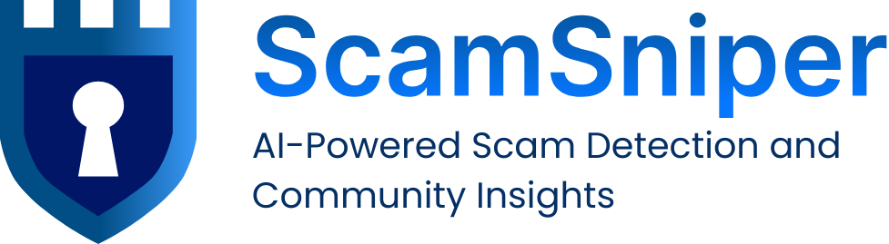

<h1 align="center">
  <br>
  <a href="https://scam-sniper.vercel.app/"></a>
  <br>
  ScamSniper
  <br>
</h1>

<h4 align="center">An AI-powered scam detection and awareness platform built with <a href="https://nextjs.org" target="_blank">Next.js</a>.</h4>

<p align="center">
  <a href="https://scam-sniper.vercel.app">
    
  </a>
  <a href="https://nextjs.org/">
    
  </a>
  <a href="https://www.prisma.io/">
    
  </a>
  <a href="https://supabase.com/">
    
  </a>
  <a href="https://greensock.com/gsap/">
    
  </a>
</p>

<p align="center">
<a href="#🏆-recognition">Recognition</a> •
<a href="#✨-key-features">Key Features</a> •
<a href="#🛠️-how-to-use">How To Use</a> •
<a href="#🔗-related">Related</a>

</p>


## 🏆 Recognition

> ScamSniper was awarded the **Excellence Award** at the **2025 Asia Impact Hackathon**, an international competition co-hosted by **Yonsei University** and the **Korean Policy Association**, and sponsored by **Google**, with over 300 teams from 12 Asian countries.

## ✨ Key Features

- 🔐 AI-Powered Scam Detection
  - Engage with an interactive AI chat interface to analyze suspicious content seamlessly.
  - Upload images to generate detailed scam reports that highlight key behavioral indicators such as Emotional, Monetary, and Urgency Appeals, alongside technical validations including Timestamp, Location, Phone Number, and Email verification.
  - Receive a clear scam likelihood classification on a 0 to 10 scale, accompanied by a concise summary with actionable insights for quick and informed risk assessment.
- 💬 Community Forum
  - Connect with others to share experiences, report suspicious activities, and stay up to date on the latest scam tactics.
  - Upload AI-generated scam reports to the forum to crowdsource feedback.
- 🎓 Interactive Scam Education
  - Learn to recognize scams through engaging animated simulations.

## 🛠️ How To Use

To clone and run this application, you'll need [Git](https://git-scm.com) and [Node.js](https://nodejs.org/en/download/) (which comes with [npm](http://npmjs.com)) installed on your computer. From your command line:

```bash
# 1. Clone this repository
git clone https://github.com/ItsMeOX/ScamSniper

# 2. Go into the repository
cd ScamSniper

# 3. Install dependencies
npm install  # or use yarn / pnpm / bun

# 4. Start the development server
npm run dev  # or yarn dev / pnpm dev / bun dev
```

Once the development server is running, open your browser and go to:

```bash
http://localhost:3000
```

## 🔗 Related

- [Hackathon Official Website (TO BE UPDATED)](https://www.dchallenge.org/hackathons/hackathons-2025)
- [Hackathon Youtube Demos (TO BE UPDATED)](https://www.youtube.com/@dchallenge2023)
